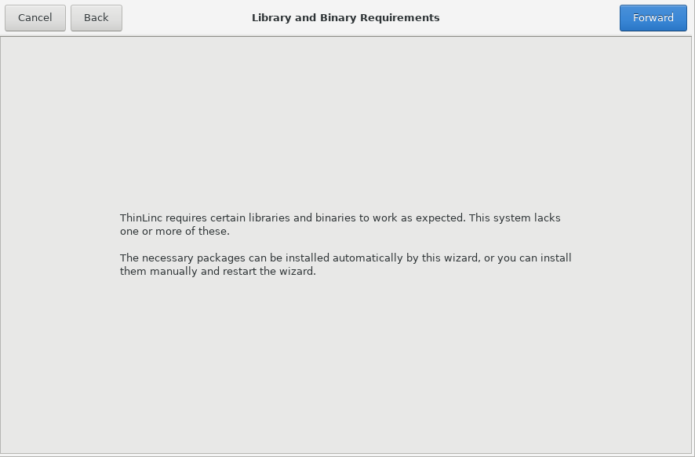

## ThinLinc - Remote Desktop Server:

To install the ThinLinc Remote Desktop Server on Rocky Linux, follow these steps:


### Desktop environment:

Make sure you have installed a desktop environment, such as `Xfce`, `LXDE`, `MATE` or other. Please refer to your distribution documentation for how to install these. For best performance, we recommend installing a more lightweight desktop environment without compositing.


### Installing ThinLinc server:


```
unzip tl-4.17.0-server.zip
```


```
cd tl-4.17.0-server

./install-server
```


   
   
   
   
   
   
   
   
   
   
   
   
   
   
   
   
   
   
   
   
   


### Verifying the installation:

After the installation has finished, you can verifiy that the ThinLinc server services have been started correctly

```
systemctl status vsmserver
systemctl status vsmagent
systemctl status tlwebaccess
```


```
netstat -tlpn | grep 300

tcp6       0      0 :::300      :::*      LISTEN      1029480/python3
```


_The ThinLinc server logfiles which can provide information on why they failed to start:_

```
/var/log/vsmserver.log
/var/log/vsmagent.log
/var/log/tlwebaccess.log
```


### Run ThinLinc administration commands using sudo:

```
```


### Web Console:

The ThinLinc Web Console is accessible over HTTPS on port `300`. To access it: `https://<server_ip>:300`


### Links:

- [To get started with ThinLinc](https://www.cendio.com/thinlinc/how-to-get-started/)
- [Download ThinLinc](https://www.cendio.com/thinlinc/download/)
- [Installing ThinLinc server](https://www.cendio.com/thinlinc/docs/install/)
- [Installing the ThinLinc Remote Desktop](https://www.cendio.com/resources/docs/tag/install_install.html#install-install)


